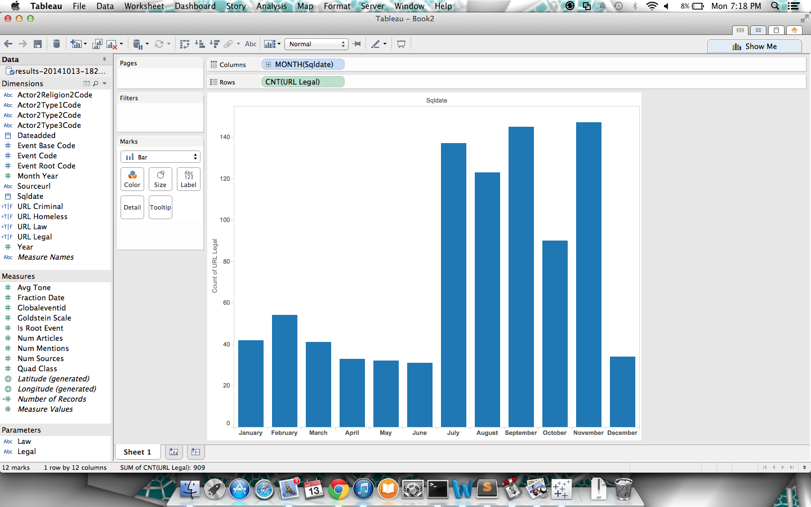

# Team Members

* [Austin Wood](https://github.com/indiesquidge)
* [Ian Ker-Seymer](https://github.com/ianks)
* [Chris Wittenberg](https://github.com/cwitty1919)
* [Sam Korn](https://github.com/sako0938)
* [Daniel Nolan](https://github.com/dano8957)

# Objective 1. Pick your public policy change issue.

* [Criminalization of Homelessness](http://nationalhomeless.org/issues/civil-rights/)

# Objective 2. Analyze & discuss your issue.

## Related Events Increase/Decrease


```sql
SELECT *,
  FROM [gdelt-bq:full.events]
  WHERE SOURCEURL CONTAINS "homeless"
  AND (SOURCEURL CONTAINS "legal"
  OR   SOURCEURL CONTAINS "criminal"
  OR   SOURCEURL CONTAINS "rights"
  OR   SOURCEURL CONTAINS "prohibit"
  OR   SOURCEURL CONTAINS "law")
  AND NOT SOURCEURL CONTAINS "help";
```

As you can see, there are certain days which have tons of activity with respect
to homelessness and law. In particular January 7th had issues about homelessness
with coldfronts in the weather. Overall, it seemed that the data about criminalization
of homelessness got drowned out by data about the homeless.

## Actors Involved


We can infer that the most article mentions comes out of the state of California. Los Angeles has a red Goldstein scale which related to negative results within the state. Murfreesboro is mainly on the negative side of Goldstein scale and has no beneficial articles relative to homelessness. This shows that places like Los Angeles, Murfreesboro, and the state of West Virginia are main places where homeless people are criminalized.

## Georeferencing


## Source URLs


There is more articles abouts homelessness in the summer, and the winter months when the issues facing the homeless are the most apparent.

## Conclusions

Using an SQL parsing script, we pulled lots of sources that revolved around buzz words like "criminal" and "homeless". Our data was definitely trending for the criminalization of homelessness, but the data was very messy and came with a lot of baggage. The data we found was very interesting and definitely met our hypotheses, but it wasn't factual enough to prove the trends with the data alone.

You can see that, especially from the Georeferencing screenshot, that there is a high correlation between the number of articles, the Goldstein scale, and the states/cities where we found homelessness to be a problem. It's very clear that California is having a problem with this, but there is a negative ranking on the Goldstein scale, indicating (perhaps) that people are not on board with the idea of criminalizing homelessness. Hawaii and other places in Europe also follow this trend. Essentially, when there is a high number of articles surrounding this issue, most people aren't on board with the actions the government is taking.
